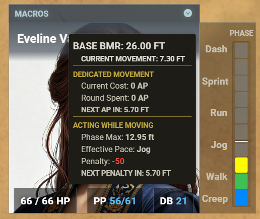

# Argon Combat HUD extension for Rolemaster Unified (RMU)

An implementation of the [Argon - Combat HUD](https://foundryvtt.com/packages/enhancedcombathud) (by [TheRipper93](https://theripper93.com/) and [Mouse0270](https://github.com/mouse0270)) for the Rolemaster Unified (RMU) system. The Argon Combat HUD (CORE) module is required for this module to work.

---

### Attack Panel

### Spell Panel including search bar

### Skill Panel including search bar

### Resistance Rolls

### Endurance Rolls

### Set Defenses

**Documentation for core Argon HUD features can be found at [TheRipper93's Wiki](https://api.theripper93.com/modulewiki/enhancedcombathud/free).**

This module adjusts various Argon Combat HUD features for the Rolemaster Unified system:

* **Portrait:** A customised portrait panel showing HP, Power Points, and Defensive Bonus, with buttons to open the character sheet, set defences (dodge, block and other DB modifier), and to roll initiative. At the top of the portrait is a drawer where you can access any macros on your macro hotbar.
* **Movement HUD:** Integrates with the RMU movement system showing the current movement in the phase and how much you can move before spending the next AP (dedicated movement) or incurring the next penalty (acting while moving). The Movement HUD is only visible when in combat.

    

* **Attacks:** Categorised attack buttons for Melee, Ranged, Natural (including innate magic), and Shield attacks. Weapons can be equipped and unequipped within the panel.
* **Other panels:** Dedicated panels for:
  * Spell Casting (including any follow-up attack roll)
  * Skill Manoeuvre Rolls (including Spell Mastery)
  * Resistance Rolls
  * Endurance Checks (Physical/Mental)
* **Search:** A search tool for spells and skills. Just start typing and it will show any spells or skills matching your text and the number found on the right of the search bar. Click the clear icon in the search bar to reset the filter. There are also toggled filters for specific spell or skill properties such as filtering for spells that can be cast instantaneously or sub-consciously.
* **Utilities:**
  * A "Rest" button to open the RMU rest dialogue.
  * A combat panel to end the current combatant's turn (only visible when in combat).
* **Tooltips:** Each action button has a rich tooltip showing the same data available in the character sheet.

## Casting spells

In RMU you potentially need to make three rolls to cast a spell. On the Actor Sheet all these are found in the same tab, but in Argon Combat HUD for RMU they are split between two panels.

1. [Optional] A Spell Mastery roll to successfully adapt a spell from its base description. Spell Mastery rolls can be made from the **Skills Panel** using the appropriate **Spell List** skill.
2. [Mandatory] A Spell Casting Roll (SCR) is always required. SCR can be made from the **Spells Panel** using the appropriate **Spell**.
3. [Conditional] Some spells require an attack roll. If a spell has an associated attack, it will show both its SCR bonus and OB bonus on the spell's button. Clicking it once will make the Spell Casting Roll. It will then change its appearance to have a warmer background, change its icon, only show its OB bonus, and (for area spells) remind you to place the template (in the SCR chat card result). Clicking again will roll the attack. If the SCR roll fails (which the HUD cannot detect), you can dismiss the armed state by right-clicking the button.

## Dependencies

|Argon Combat HUD (RMU)|RMU System|Argon Combat HUD (CORE)|
|---|---|---|
|1.1.0|1.0.0|4.1.0|
|1.0.1|1.0.0|4.1.0|
|1.0.0|1.0.0|4.0.7|

## Version History

[Version History](VERSION.md)

## Roadmap

* Using Items with activated effects (waiting on a system dependency)

**If you have suggestions, questions, or requests for additional features, please [let me know](https://github.com/Filroden/enhancedcombathud-rmu/issues).**
