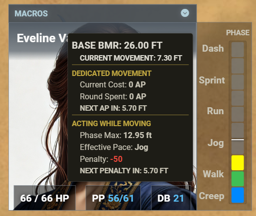

# Argon Combat HUD extension for Rolemaster Unified (RMU)

## Welcome to Argon Combat HUD extension for Rolemaster Unified (RMU)

An implementation of the [Argon - Combat HUD](https://foundryvtt.com/packages/enhancedcombathud) (by [TheRipper93](https://theripper93.com/) and [Mouse0270](https://github.com/mouse0270)) for the Rolemaster Unified (RMU) system. The Argon Combat HUD (CORE) module is required for this module to work.

Please install the correct version of the module:

- **v1.x is compatible with v13 of FoundryVTT:** This version is only being updated for bug fixes and will not contain features added to v2.
- **v2.x is compatible with v14 of FoundryVTT.**

---

## Attack Panel

## Spell Panel including search bar

## Skill Panel including search bar

## Resistance Rolls

## Endurance Rolls

## Set Defenses

**Documentation for core Argon HUD features can be found at [TheRipper93's Wiki](https://api.theripper93.com/modulewiki/enhancedcombathud/free).**

This module adjusts various Argon Combat HUD features for the Rolemaster Unified system:

- **Portrait:** A customised portrait panel showing HP, Power Points, and Defensive Bonus, with buttons to open the character sheet, set defences (dodge, block and other DB modifier), and to roll initiative. At the top of the portrait is a drawer where you can access any macros on your macro hotbar.
- **Movement HUD:** Integrates with the RMU movement system to show your current phase movement, detailing how much further you can move before spending your next AP (for dedicated movement) or incurring the next pace penalty (for acting while moving). Note: This HUD is only visible during combat. Movement accumulates across phases to calculate the total AP cost or the maximum pace reached while acting (the GM determines if a round has 1, 2, or 4 phases when creating the combat). If you make an attack or cast a spell using the HUD, it will automatically reset your pace penalty. If you take a different action, you can manually clear the tracker by clicking the "Reset Pace Penalty" icon above your portrait.

    

- **Attacks:** Categorised attack buttons for Melee, Ranged, Natural (including innate magic), and Shield attacks. Weapons can be equipped and unequipped within the panel.
- **Other panels:** Dedicated panels for:
  - Spell Casting (including any follow-up attack roll)
  - Skill Manoeuvre Rolls (including Spell Mastery)
  - Resistance Rolls
  - Endurance Checks (Physical/Mental)
- **Search:** A search tool for spells and skills. Just start typing and it will show any spells or skills matching your text and the number found on the right of the search bar. Click the clear icon in the search bar to reset the filter. There are also toggled filters for specific spell or skill properties such as filtering for favourites, or for spells that can be cast instantaneously or sub-consciously, or for skills which have 1 or more ranks.
- **Utilities:**
  - A "Rest" button to open the RMU rest dialogue.
  - A combat panel to end the current combatant's turn (only visible when in combat).
- **Tooltips:** Each action button has a rich tooltip showing the same data available in the character sheet.

## Casting spells

In RMU you potentially need to make three rolls to cast a spell. On the Actor Sheet all these are found in the same tab, but in Argon Combat HUD for RMU they are split between two panels.

1. [**Optional**] A Spell Mastery roll to successfully adapt a spell from its base description. Spell Mastery rolls can be made from the **Skills Panel** using the appropriate **Spell List** skill.
2. [**Mandatory**] A Spell Casting Roll (SCR) is always required. SCR can be made from the **Spells Panel** using the appropriate **Spell**.
3. [**Conditional**] Some spells require an attack roll. If a spell has an associated attack, it will be shown in the chat card generated by the Spell Casting Roll.

## Dependencies

The table below only shows the earliest version where a dependency has changed. Later versions share the same dependencies.

|Argon Combat HUD (RMU)|RMU System|Argon Combat HUD (CORE)|FoundryVTT|
|:---:|:---:|:---:|:---:|
|2.1.0|1.2.43|5.0.0|14|
|2.0.0|1.2.5|5.0.0|14|
|1.0.1|1.0.0|4.1.0|13|
|1.0.0|1.0.0|4.0.7|13|

## Version History

[Version History](VERSION.md)

## Roadmap

- Using Items with activated effects (waiting on a system dependency)

**If you have suggestions, questions, or requests for additional features, please [let me know](https://github.com/Filroden/enhancedcombathud-rmu/issues).**

## Disclaimer and IP Notice

The Argon Combat HUD extension for Rolemaster Unified (RMU) module is an unofficial, community-developed tool designed to enhance the Rolemaster Unified experience on Foundry Virtual Tabletop.

This module is completely independent and is not affiliated with, endorsed, sponsored, or approved by Iron Crown Enterprises (ICE). "Rolemaster", "Rolemaster Unified", and the "RMU" acronym are trademarks of Iron Crown Enterprises.

This project does not distribute any proprietary text, artwork, or core rulebook content belonging to ICE. It functions strictly as a mechanical, workflow, and user interface enhancement for the official RMU system on Foundry VTT. Any use of specific system terminology or mechanical values is for functional compatibility purposes only.
